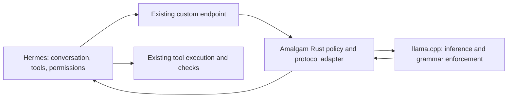

# Candidate evaluation and architecture gates

This is a proposed experiment design for T-108. No inference benchmark was
run during research, and no live Hermes setting was changed. Numerical gates
below are starting experiment limits, not established model capabilities or
an owner-approved product latency promise.

## Separate the questions

1. Can a smaller local model complete useful Hermes tasks within the hardware
   envelope, without progressive latency or resource collapse?
2. Do constraints improve tool-call and task outcomes at that same budget?
3. Does adaptive policy improve on static constraints enough to justify its
   state, integration and verification costs?
4. Is token masking itself a measured bottleneck or missing capability that
   requires a new engine?

Use the observed 27B session as a reference case. Initially favor a smaller
model that leaves room for context and the desktop; choose its exact artifact
only after inventorying available models, licenses and measured residency.
Keep a separate 27B arm when the same resource gate permits it. Do not compare
different model sizes and attribute the difference solely to constraints.

## Candidate architecture

This is the preferred **first hypothesis**, not a requirement to add a proxy
before measuring the current endpoint. A direct custom endpoint is the
baseline. Add an out-of-tree provider plugin only for concrete configuration,
capability or request-context needs. The service owns neither a second agent
loop nor tool execution.

| Candidate | First useful experiment | Selection gate |
|---|---|---|
| Existing local Hermes with bounded configuration | Measure fixed prefix, context growth, compression and cancellation | Mandatory baseline; it may solve most latency problems without new code. |
| Rust service using existing llama.cpp constraint support | Same requests and schemas; normal Hermes responses | Choose if it improves useful task outcomes without breaking cache, semantics or cancellation. |
| Optional Hermes provider plugin | Qualify configuration and per-session policy metadata | Add only for a demonstrated gap in custom endpoint setup or request context. |
| Provider-supplied in-process client | Same protocol conformance suite | Consider only when measured HTTP/process costs or an unavailable feature justify tighter coupling. |
| New token decoder / mask engine | Small offline tokenizer/grammar microbenchmark against existing engine | Advance only for a reproduced limitation or material measured engine overhead. |

## Reproducible manifest

Record model name and GGUF hash, quantization, tokenizer/chat-template hash,
backend commit/build features, GPU offload/tensor policy, actual context and
parallelism, K/V formats, CPU/batch/thread settings, Hermes commit, non-secret
config values, auxiliary route, seed/sampling/reasoning budget, OS/driver,
GPU VRAM and available host RAM. A configured model context maximum is not a
memory or latency budget. Do not infer llguidance support from JSON validity.

Collect per request: full and uncached input tokens, output/reasoning tokens
where exposed, first meaningful token time (separate from heartbeat/first
chunk), queue time, prefill time/rate, decode time/rate, total time, actual
cached tokens, context allocation, restarts, compression input/output size
and outcome, process RSS/commit, system committed memory/available memory,
page-fault or paging evidence, VRAM and host responsiveness. Missing signals
are marked unavailable. Correlate all records by session/request ID.

## Bounded execution

1. Inventory and tokenize a synthetic request offline. Measure the fixed
   system/tool prefix before setting a context budget; a nominal 4K window
   cannot host a 20K prefix. Choose the minimal sufficient toolset once at
   session start. Instructional skills are still read completely.
2. Start one request at a time on a deliberately small synthetic context
   (up to 4K input and 128 output tokens where the measured prefix fits).
   Use a fresh Hermes process/profile with `local_runtime.enabled: false`
   and a separately launched fixed-context llama-server on a distinct endpoint.
   Set `--ctx-size` and parallelism explicitly; verify the reported allocation.
   There is no dedicated managed-growth toggle in the inspected code, and
   changing this setting does not reconfigure an already-running backend.
3. Initial watchdog proposal: 120 seconds per smoke request, at least 4 GiB
   system available RAM and 1 GiB dedicated VRAM headroom. These margins must
   be checked against the actual host and model before launch. Fail the pilot
   if it cannot fit; do not let the runner increase context or timeout.
4. Prove cancellation terminates server work and leaves no orphan request.
   Test an auxiliary/compression request as well as an ordinary request.
   Keep a process-level stop mechanism outside the model's control.
5. Only after the pilot passes, step up context in bounded increments to
   a predeclared cap. A long run has a maximum request count and total wall
   time, plus memory/paging/latency stop conditions. Stop at the first breach.
   The host must remain responsive; no replay of the original unbounded run.
6. Compression experiments must complete and demonstrably reduce context
   before the resource cap; a timeout is a failed trial. Preserve a resumable
   record when it fails. Do not repeatedly retry the same oversized history.

## Controls and tasks

Within each fixed model/backend/configuration block, compare:

- A: ordinary Hermes native tool calls on the local endpoint;
- B: a static constrained action protocol;
- C: adaptive constraints derived from explicit state and capability;
- D (only if warranted): model-proposed grammar checked by trusted code, or
  an alternative token-mask engine.

Report whether A already enforces grammar through its tool-call template;
it must not be mislabeled "unconstrained". Hold context management fixed for
A/B/C first, then run an orthogonal comparison of context policies. Match
sampling, output budgets, model/template, task corpus and warm/cold conditions.
Counterbalance run order to reduce cache/thermal bias. One successful demo
does not qualify a profile; use repeated paired runs and publish denominators,
failures and uncertainty. Start with three repetitions as a pilot, not a
statistical claim; expand only within the total resource/time cap.

Task set: file lookup with verifiable evidence; one controlled edit plus its
real test; recovery from a failed command; a no-op/read-only task; native
streaming tool calls; and a multistep artifact task with external acceptance
checks. Include hostile tool output in the synthetic fixture to test that
   tool-returned text cannot change policy or authorization in these cases. Full skill content
can be a later long-input case after the small cases pass.

Measure schema-valid calls, semantic argument validity, correct tool choice,
independently verified completion, user corrections, repeated/no-progress
calls, generated tokens, end-to-end latency and peak resources separately.
Give schema failures/unsupported constraints explicit outcomes rather than
silently retrying without the promised constraint.

## Definition of adaptive to take into intent review

Candidate: a deterministic, logged policy maps backend/model capabilities,
trusted task state, verified outcomes and remaining resource budget to the
next permitted action language and output budget. The same inputs yield the
same policy decision. Adaptation cannot enlarge user authority. Keep the
conversation's rendered prefix and tool catalog stable; prove any metadata
change is cache-compatible in the selected backend.

Model-generated constraints are untrusted proposals. Check schema validity,
satisfiability, size/compilation budget and authority against trusted bounds.
Never derive permissions from model confidence or an unchecked success claim.
This is distinct from implementing a new token-mask algorithm.

## Research gates

- Adopt static constraints only if they improve valid execution or task
  completion within the declared resource budget.
- Adopt adaptation only if paired results improve on static policy without
  weaker permissions, cache churn or hidden retries. Retain the simpler arm
  if the evidence is inconclusive.
- Consider a new decoder only when profiler/coverage evidence isolates an
  engine problem after context, offload and template issues are controlled.
- Carry an explicit negative result forward. A smaller model or shorter
  qualified workload can be the correct outcome.

## Literature boundaries

[llama.cpp server documentation](https://github.com/ggml-org/llama.cpp/blob/master/tools/server/README.md)
describes cached-token and prefill/decode timing fields. Qualify their presence
on the actual installed build; current master is not evidence of its behavior.

[llama.cpp llguidance documentation](https://github.com/ggml-org/llama.cpp/blob/master/docs/llguidance.md)
describes a build option for using llguidance with JSON Schema and grammars.
That is a reusable enforcement route, subject to actual build qualification.

[JSONSchemaBench](https://arxiv.org/abs/2501.10868v3) evaluates efficiency,
constraint coverage and output quality separately; this informs the separate
metrics above, not an expected win for a particular Amalgam backend.

[Grammar-Aligned Decoding](https://arxiv.org/abs/2405.21047v4) identifies
distribution distortion from ordinary grammar constraints and studies an
adaptive sampling approach. It justifies measuring semantic quality; it does
not establish that its algorithm fits this GPU or solves the logged slowdown.

AACD here names the Animus policy/design lineage. This research does not make
a priority or novelty claim about constrained/adaptive decoding generally.
